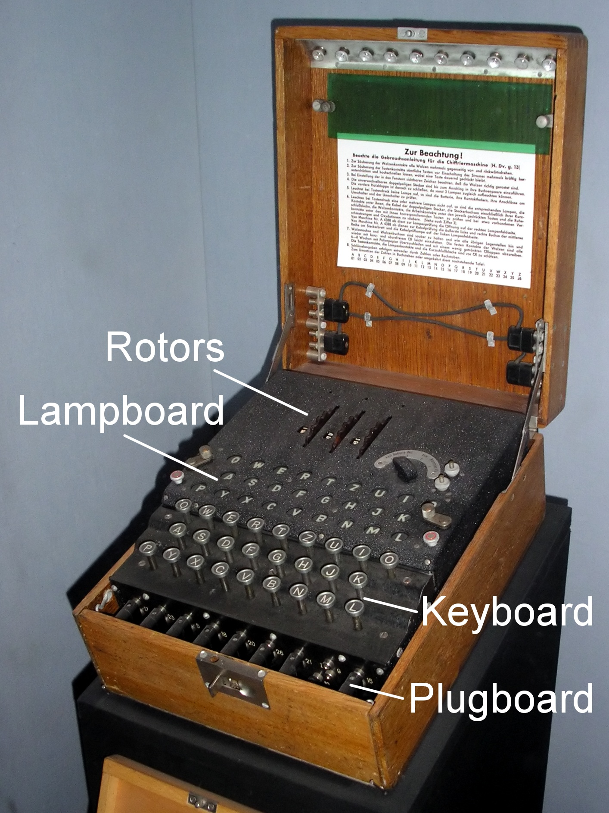

The Enigma machine is the most famous cipher machine to date. Nazi
Germany used it during World War II to encrypt messages so that
enemies could not understand them.  The story of the British
cryptanalysts who successfully deciphered Enigma has become the
subject of multiple movies *Enigma* (2001); *The Imitation Game*
(2014).  In this exercise, we will focus our attention on a simplified
version of the Enigma machine, which we name "Little Enigma." Like the
real Enigma machine shown in the picture above, this machine consists
of two key components.  First, the Little Enigma machine has 5
different *rotors*, each of which comes with 10 pins with numbers
ranging from 0 to 9. Second, a component called the *plugboard*
contains 26 holes, corresponding to the 26 letters of the alphabet. In
addition, 13 cables connect all possible pairs of letters. Since a
cable has two ends, one can connect, for example, the letter A with
any other of the other 25 letters present in the plugboard.

To either encode a message or decode an encrypted message, one must
provide the Little Enigma machine with a correct five-digit passcode
to align the rotors and a correct configuration of the plugboard. The
rotors are set up just like many combination locks. For example, the
passcode 9--4--2--4--9 means that five rotors display the numbers 9,
4, 2, 4, and 9 in that order.  In addition, the 13 cables connecting
the letters in the plugboard must be appropriately configured. The
purpose of the plugboard is thus to scramble the letters.  For
example, if B is connected to W, the Little Enigma machine will switch
B with W and W with B to encode a message or decode an encoded
message.  Thus, a sender types a message on the keyboard, the
plugboard scrambles the letters, and the message is sent in its
encrypted form.  A receiver decodes the encrypted message by re-typing
it on a paired Little Enigma machine that has the same passcode and
plugboard configuration.

## Question 1

How many different five-digit passcodes can be set out of the 5
rotors?

## Answer 1

We know that each rotor has 10 pins.  Thus, for each rotor we have 10
possible choices to select a one-digit number. Since we have five
rotors, the total number of five-digit passcodes is given by $10^5$.
We take the logarithmic transformation since the number is large and
save the value for later use.

```{r}
log.rotors <- 5 * log(10)
``` 

## Question 2

How many possible configurations does the plugboard provide?  In other words, how many ways can 26 letters be divided into 13 pairs?

## Answer 2

We first count all possible ways to make 13 pairs out of 26
letters. There are $_{26}C_2 = \text{choose}(26, 2)$ ways to choose
the first pair. Once the first pair is selected, there are $_{24}C_2=
\text{choose}(24, 2)$ ways to choose the second pair. The same process
can be repeated until all 13 pairs are selected. Therefore, the total
number of pairs is given by $_{26} C_2 \times _{24}C_2 \times _{22}C_2
\times \ldots \times _2C_2$.  We compute this in R.

```{r}
n <- seq(from = 26, to = 2, by = -2)
nCk <- choose(n, 2)
## recall log(AB) = log(A) + log(B)
log.allways <- sum(log(nCk))
exp(log.allways)
```

However, not all of these pairs are unique. To see this point, suppose
we only have 4 letters *A,B,C,D*.  Using the same logic as above,
there are $_4C_2 \times _2C_2 = 6$ ways, in which we can construct 2
pairs. One of the possible ways is given by pairing *A* with *D* first
and then pairing *B* with *C*.  Another possibility is to pair *B* and
*C* first and then pair *A* and *D* next.  But, these two ways are
equivalent. Since the order of pair creation does not matter, we must
divide the total number we obtained above by the total number of ways
in which we can arrange 13 pairs, i.e., $_{13}P_{13} = 13!$. Thus, the
total number of ways to set the plugboard is given by,

```{r}
log.plugboard <- log.allways - lfactorial(13)
exp(log.plugboard)
```

## Question 3

Based on the previous two questions, what is the total number of
possible settings for the Little Enigma machine?

## Answer 3

To obtain the total number of possible settings for Little Enigma, we
just need to realize that for every five-digit passcode, we will have
$`r exp(log.plugboard)`$ ways to order the plugboard. Thus, the total
number of settings is given by,

```{r}
log.enigma <- log.rotors + log.plugboard
exp(log.enigma)
```

## Question 4

Five cryptanalytic machines have been developed to decode 1,500
messages encrypted by the Little Enigma machine.  The table below
presents information on the number of messages assigned to each
machine and the machine's failure rate (i.e., the percentage of
messages the machine was unable to decode).  Aside from this
information, we do not know anything about the assignment of each
message to a machine or whether the machine was able to correctly
decode the message.

Machine       Number of messages Failure Rate
------------- ------------------ ------------
`Banburismus`                300          10%
`Bombe`                      400           5%
`Herivel`                    250          15%
`Crib`                       340          17%
`Hut 6`                      210          20% 

Suppose that we select one message at random from the pool of all
1,500 messages but found out this message was not properly
decoded. Which machine is most likely responsible for this mistake?

## Answer 4

Define $P(M_i)$ as the probability that a randomly chosen message was
assigned to machine $i$.  Let $U$ denote the event that some machine
failed to decode a message. Then, we are interested in determining
machine $i$ for which $P(M_i \mid U)$ is the greatest.  Applying
Bayes' rule, we have,

$$
 P(M_i \mid U) \ = \ \frac{P(U \mid M_i) P(M_i)}{P(U)} \ = \
 \frac{P(U \mid M_i) P(M_i)}{\sum_{j=1}^5 P(U \mid M_j) P(M_j)} 
$$

where $P(U \mid M_i)$ is the failure rate for each machine.  We can
compute this probability for each machine using R.

```{r} 
## P(M_i)
pM <- c(300, 400, 250, 340, 210) # number of messages
pM <- pM / sum(pM) 
## Failure rates p(U | M_i)
pUM <- c(0.1, 0.05, 0.15, 0.17, 0.2)
## P(M_i | U)
pMU <- pM * pUM / sum(pM * pUM)
pMU
```

From this result, we conclude that 'Crib', which corresponds to the
fourth and largest probability, is most likely responsible for the
failure to decode the message.

## Question 5

Write an R function that randomly configures the plugboard. This
function will take no input but randomly selects a set of 13 pairs of
letters.  The output object should be a $2 \times 13$ matrix for which
each column represents a pair of letters.  You may use the built-in R
object `letters`, which contains the 26 letters of the alphabet as a
character vector.  Name the function `plugboard`.

## Answer 5

```{r}
## version 1 (loop)
plugboard <- function() {		
    letters.left <- letters # remaining alphabet letters
    pairs <- matrix(NA, nrow = 2, ncol = 13) # container
    for(i in 1:13) {
        ## sampling without replacement
        indx <- sample(1:length(letters.left), 2, replace = FALSE) 
        pairs[, i] <- letters.left[indx]
        letters.left <- letters.left[-indx] # remove the selected letters
    }		
    return(pairs)
}

## version 2 (no loop)
plugboard <- function() {
    pairs <- matrix(sample(letters, size = length(letters), 
                           replace = FALSE), nrow = 2, ncol = 13)
  return(pairs)
}
plug.config <- plugboard()
plug.config
```

## Question 6

Write an R function that encodes and decodes a message given a
plugboard configuration set by the `plugboard` function from the
previous question.  This function should take the output of the
`plugboard` function as well as a message to be encoded (decoded) as
inputs, and return an encoded (decoded) message.  You may wish to use
the `gsub` function, which replaces a pattern in a character string
with another specified pattern. The `tolower` function, which makes
characters in a character vector lowercase, and `toupper` function,
which capitalizes characters in a character vector, can also help.

## Answer 6

The following function takes a message `x` and a plugboard
configuration `plug.config` and returns the encoded message. The same
function then can be used to decode an encoded message.
  
```{r}
little.enigma <- function(x, plug.config) {
    ## lower cases indicate letters that need to be switched
    ## upper cases indicate letters that have been changed
    x.encoded <- tolower(x)
    plug.config.up <- toupper(plug.config)
    ## switch letters
    for(i in 1:13) {
        x.encoded <- gsub(plug.config[1, i], plug.config.up[2, i], 
                          x.encoded)
        x.encoded <- gsub(plug.config[2, i], plug.config.up[1, i], 
                          x.encoded)
    }
    ## change it back to lower cases
    x.encoded <- tolower(x.encoded)
    return(x.encoded)
}
text <- "hello little enigma" 
## encode text
text.encoded <- little.enigma(text, plug.config)
text.encoded
## decode it 
little.enigma(text.encoded, plug.config)
```
